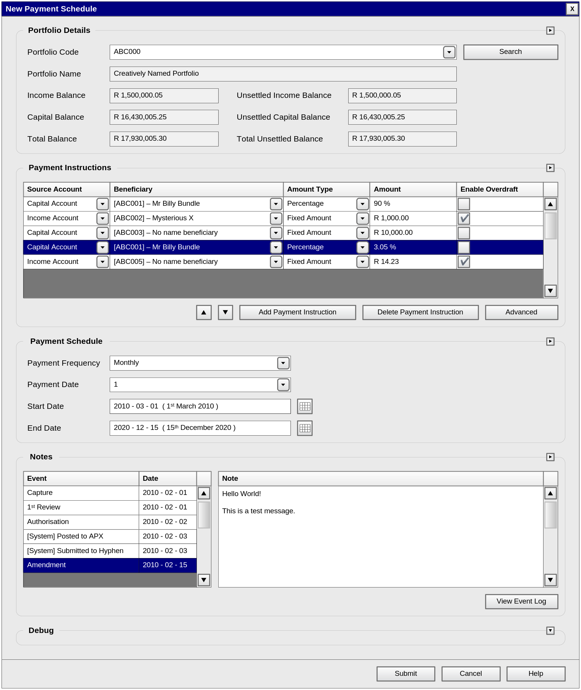
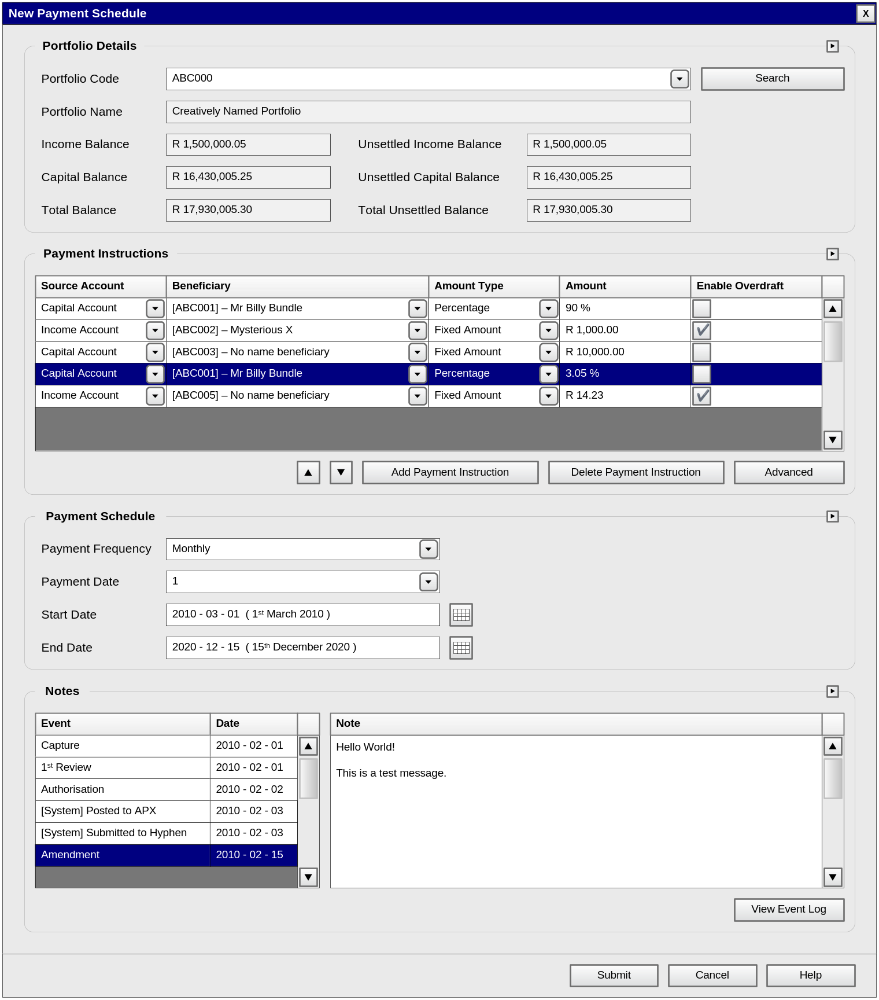

# APX Payment Manager

An investment fund disbursement payment management solution, that integrates with [Advent Portfolio Exchange](https://www.advent.com/solutions/advent-portfolio-exchange/).

## Overview

The APX Payment Manager project offers a suite of applications that can be used by investment fund managers to facilitate disbursement payment scheduling and distribution patterns, for investment funds managed with [Advent Portfolio Exchange](https://www.advent.com/solutions/advent-portfolio-exchange/). The APX Payment Manager suite of applications includes the following.

- **APXPaymentManager**: The main application used by fund managers on a day-to-day basis to manage scheduled disbursement payments. APXPaymentManager integrates directly with [Advent Portfolio Exchange](https://www.advent.com/solutions/advent-portfolio-exchange/).
- **AdventAPXSimulator**: An [Advent Portfolio Exchange](https://www.advent.com/solutions/advent-portfolio-exchange/) simulator, used for development and testing integration with [Advent Portfolio Exchange](https://www.advent.com/solutions/advent-portfolio-exchange/).
- **APXPaymentScheduler**: *Deprecated. Features rolled into **APXPaymentManager**.*
- **HyphenNAPSSimulator**: A [Hyphen NAPS](https://www.hyphen.co.za/downloads/Hyphen_FACT-Sheet_Notifications.pdf) simulator for development and testing of integration with [Hyphen NAPS](https://www.hyphen.co.za/downloads/Hyphen_FACT-Sheet_Notifications.pdf) (Hyphen **N**ominated **A**ccount **P**ayments **S**ystem).
- **HyphenFACSSimulator**: A [Hyphen FACS](https://w01.hyphen.co.za/) simulator for development and testing of integration with [Hyphen FACS](https://w01.hyphen.co.za/) (Hyphen **F**inancial **A**ctivity **C**ontrol **S**ystem).

## User Interface Samples

   &nbsp; 

## Status

This is a legacy project, archived here for reference. The application source is currently private.

## License

Copyright © 2011 Rohin Gosling. All rights reserved.

This repository is published for reference and portfolio purposes only. No permission is granted to use, copy, modify, or distribute any part of it without prior written permission. See [LICENSE](LICENSE) for the full terms.
